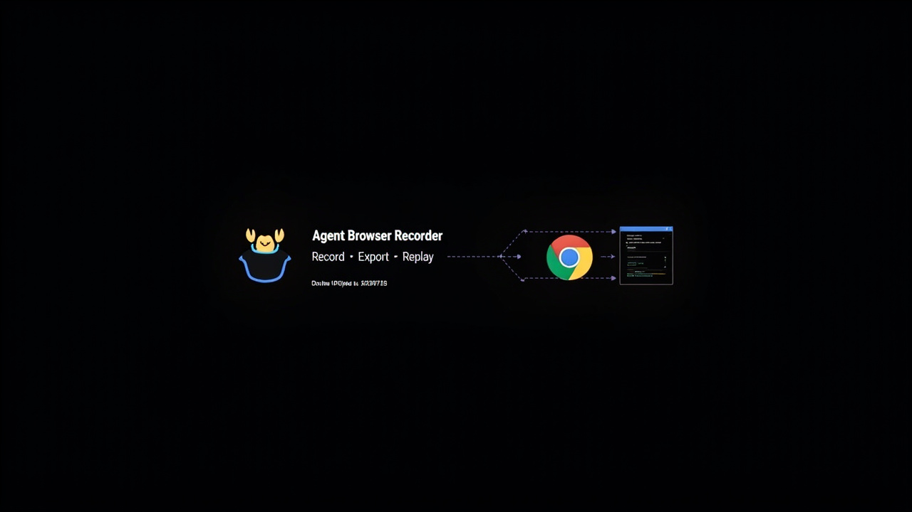

<div align="center">
  
  
  <h1>🦀 Agent Browser Recorder</h1>
  
  <p><strong>录制浏览器操作 → 生成 agent-browser 脚本 → 一键回放</strong></p>
  
  [](https://developer.chrome.com/docs/extensions/)
  [](LICENSE)
  [](https://github.com/Jiaoma/agent-browser-recorder/releases)
  
  <p>
    <a href="#english">English</a> · <a href="#中文">中文</a>
  </p>
</div>

---

<a id="english"></a>

## ✨ Features

- 🎯 **Snapshot + @ref Strategy** — Uses `agent-browser snapshot -i --json` to find elements, the most reliable approach
- 🖱️ **Full Interaction Capture** — Clicks, typing, selects, checkboxes, scrolls, keyboard shortcuts, hover, navigation
- 📊 **Table Data Extraction** — Supports native `<table>`, ARIA grids, and virtual tables (Semi Design, Ant Design, etc.)
- 🌐 **Cross-Tab Recording** — Automatically continues recording in new tabs and pages
- ⚡ **3 Export Formats** — Node.js script (recommended), Bash script, Batch JSON
- ▶️ **One-Click Replay** — Save & run directly from the extension
- 🔴 **Visual Feedback** — Draggable REC indicator, click highlights, action counter
- ⌨️ **Keyboard Shortcut** — `Cmd+Shift+R` / `Ctrl+Shift+R` to toggle recording

## 🚀 Quick Start

### Install

```bash
git clone https://github.com/Jiaoma/agent-browser-recorder.git
cd agent-browser-recorder
bash build.sh
```

1. Open `chrome://extensions`
2. Enable **Developer mode** (top right)
3. Click **Load unpacked** → select the `build/` directory
4. **Refresh target page** (required for content script injection)

### Record & Replay

```
1. 🦀 Click the extension icon → Click Record
2. 🖱️ Interact with the page normally
3. ⏹ Click Stop when done
4. ⚡ Export .js / ▶️ Replay
```

### Run the Script

```bash
# Generated scripts use agent-browser CLI
node recording.js

# Or for pages requiring login:
agent-browser open https://example.com/login
# ... login manually ...
agent-browser state save ./auth.json
# Then uncomment AUTH_STATE line in the script
```

## 📊 Table Extraction

The extension automatically detects when you click inside a table and records data extraction:

| Table Type | Detection Method | Example |
|---|---|---|
| **Native `<table>`** | `querySelectorAll('table')` | Standard HTML tables |
| **ARIA Grid** | `role="table" / "grid"` | Accessible virtual tables |
| **SPA Virtual** | DOM structure analysis | Semi Design, Ant Design div-tables |

**Output example:**
```json
{"品牌": "Synology", "型号": "HAT5320-24T", "容量": "24TB", "级别": "Enterprise"}
```

## 📦 Export Formats

### ⚡ .js (Recommended)
Node.js script with `snapshot -i --json` → parse refs → act. Most reliable.

```js
// Uses findRef() to locate elements via agent-browser's accessibility tree
ref = await findRef("Submit");
if (ref) { await ab("click", `@${ref}`); }
```

### 📄 .sh
Bash script with grep-based ref extraction. For environments without Node.js.

### 📦 Batch JSON
`agent-browser batch` stdin format. Static command list.

## 🎬 Generated Command Mapping

| Your Action | Generated Code |
|---|---|
| Click "Submit" button | `findRef("Submit") → click @ref` |
| Type in email field | `findRef("Email") → fill @ref "text"` |
| Select dropdown option | `findRef("select") → fill @ref "value"` |
| Click table row | `eval → extract table[N] row[N]` |
| Scroll down 500px | `scroll down 500` |
| Navigate to URL | `open "https://..."` |
| Press Enter | `press Enter` |

## 🏗 Architecture

```
src/
├── manifest.json           # Chrome Manifest V3
├── background/
│   └── service-worker.js   # State management, cross-tab support
├── content/
│   ├── recorder.js         # Event capture, table detection, selectors
│   └── recorder.css        # REC indicator & highlights
├── popup/
│   ├── popup.html          # Extension popup UI
│   ├── popup.css           # Dark mode styles
│   └── popup.js            # UI logic, translator, export
└── lib/
    ├── selector.js         # CSS selector builder
    └── translator.js       # Action → script generation
```

## Requirements

- Chrome 110+ (Manifest V3)
- [agent-browser CLI](https://github.com/vercel-labs/agent-browser) for running exported scripts
- Node.js for `.js` export format

## License

MIT

---

<a id="中文"></a>

## ✨ 功能特性

- 🎯 **Snapshot + @ref 策略** — 使用 `agent-browser snapshot -i --json` 查找元素，最可靠的定位方式
- 🖱️ **全交互录制** — 点击、输入、选择、复选框、滚动、键盘快捷键、悬停、导航
- 📊 **表格数据提取** — 支持原生 `<table>`、ARIA 网格和虚拟表格（Semi Design、Ant Design 等）
- 🌐 **跨标签页录制** — 新标签页和页面跳转自动继续录制
- ⚡ **3 种导出格式** — Node.js 脚本（推荐）、Bash 脚本、Batch JSON
- ▶️ **一键回放** — 从扩展直接保存并运行
- 🔴 **视觉反馈** — 可拖拽 REC 指示器、点击高亮、操作计数
- ⌨️ **快捷键** — `Cmd+Shift+R` 开始/停止录制

## 🚀 快速开始

### 安装

```bash
git clone https://github.com/Jiaoma/agent-browser-recorder.git
cd agent-browser-recorder
bash build.sh
```

1. 打开 `chrome://extensions`
2. 右上角启用 **开发者模式**
3. 点击 **加载已解压的扩展程序** → 选择 `build/` 目录
4. **刷新目标页面**（content script 注入需要）

### 录制与回放

```
1. 🦀 点击扩展图标 → 点击 Record
2. 🖱️ 正常操作页面
3. ⏹ 完成后点击 Stop
4. ⚡ Export .js 导出 / ▶️ Replay 一键回放
```

### 运行脚本

```bash
# 生成的脚本使用 agent-browser CLI 执行
node recording.js

# 需要登录的页面：
agent-browser open https://example.com/login
# ... 手动登录 ...
agent-browser state save ./auth.json
# 然后取消脚本中 AUTH_STATE 行的注释
```

## 📊 表格数据提取

扩展会自动检测你点击表格内元素的操作，并记录数据提取：

| 表格类型 | 检测方式 | 适用场景 |
|---|---|---|
| **原生 `<table>`** | `querySelectorAll('table')` | 标准 HTML 表格 |
| **ARIA 网格** | `role="table" / "grid"` | 有无障碍语义的虚拟表格 |
| **SPA 虚拟表格** | DOM 结构分析 | Semi Design、Ant Design 的 div 模拟表格 |

**输出示例：**
```json
{"品牌": "Synology", "型号": "HAT5320-24T", "容量": "24TB", "级别": "Enterprise"}
```

## 📦 导出格式

### ⚡ .js（推荐）
Node.js 脚本，使用 `snapshot -i --json` → 解析 refs → 操作。最可靠。

```js
// 通过 agent-browser 的无障碍树定位元素
ref = await findRef("提交");
if (ref) { await ab("click", `@${ref}`); }
```

### 📄 .sh
Bash 脚本，使用 grep 提取 ref。适合没有 Node.js 的环境。

### 📦 Batch JSON
`agent-browser batch` stdin 格式。静态命令列表。

## 🎬 操作与命令对应

| 你的操作 | 生成的代码 |
|---|---|
| 点击"提交"按钮 | `findRef("提交") → click @ref` |
| 在邮箱框输入 | `findRef("邮箱") → fill @ref "文本"` |
| 选择下拉选项 | `findRef("选择") → fill @ref "值"` |
| 点击表格行 | `eval → extract table[N] row[N]` |
| 向下滚动 500px | `scroll down 500` |
| 导航到 URL | `open "https://..."` |
| 按 Enter | `press Enter` |

## 🏗 项目结构

```
src/
├── manifest.json           # Chrome Manifest V3
├── background/
│   └── service-worker.js   # 状态管理、跨标签页支持
├── content/
│   ├── recorder.js         # 事件捕获、表格检测、选择器
│   └── recorder.css        # REC 指示器和点击高亮样式
├── popup/
│   ├── popup.html          # 扩展弹窗 UI
│   ├── popup.css           # 暗色主题样式
│   └── popup.js            # UI 逻辑、翻译器、导出
└── lib/
    ├── selector.js         # CSS 选择器构建器
    └── translator.js       # 操作 → 脚本生成
```

## 环境要求

- Chrome 110+（Manifest V3）
- [agent-browser CLI](https://github.com/vercel-labs/agent-browser) 用于运行导出的脚本
- Node.js 用于 `.js` 导出格式

## 许可证

MIT
